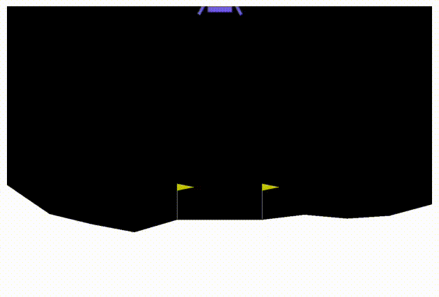

# EvoStrat 
A library that makes Evolutionary Strategies (ES) simple to use.

### Pseudo-code

```python
pop = PopulationImpl(...) # See complete examples for implementations. 
optim = torch.optim.Adam(pop.parameters()) # Use any torch.optim optimizer
for i in range(N):
    optim.zero_grads()
    pop.fitness_grads(n_samples=200) # Computes approximate gradients
    optim.step()
```

For complete examples that solves 'LunarLander-v2' see [examples/normal_lunar_lander.py](evostrat/examples/normal_lunar_lander.py) and [examples/binary_lunar_lander.py](evostrat/examples/binary_lunar_lander.py) 



### Description

Evolutionary Strategies is a powerful approach to solve reinforcement learning problems and other optimization problems where the gradients cannot be computed with backprop. 
See ["Evolution strategies as a scalable alternative to reinforcement learning"](https://arxiv.org/abs/1703.03864) for an excellent introduction.

In ES the objective is to maximize the expected fitness of a distribution of individuals. 
With a few math tricks this objective can be maximized with gradient ascent, even if the fitness function itself is not differentiable. 

This library offers
 
1. A plug-and-play implementation of ES for pytorch reinforcement learning agents with `torch.nn.Module` policy networks, that nicely separates the agent and policy network from the optimization. See [examples/normal_lunar_lander.py](evostrat/examples/normal_lunar_lander.py) 
2. A simple and flexible interface for extending ES beyond the standard Normal distribution without having to derive any gradients by hand. Just subclass [Population](evostrat/population.py)
 and implement the sampling process. See [categorical_population.py](evostrat/categorical_population.py) and [examples/binary_lunar_lander.py](evostrat/examples/binary_lunar_lander.py)  


     


 
